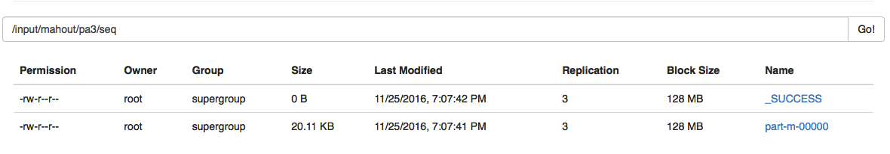
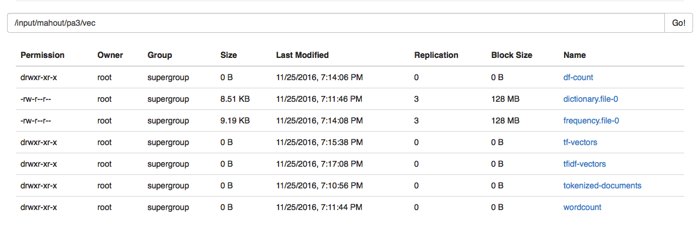
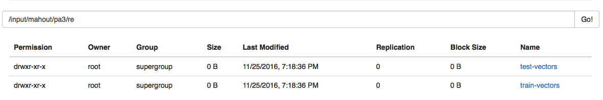
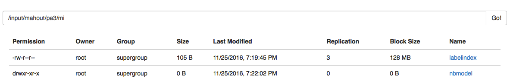
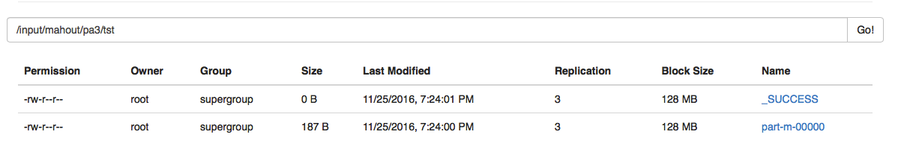
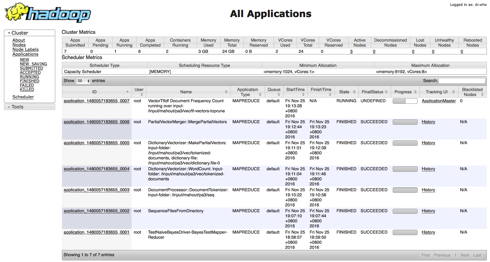

##一、使用mapreduce处理数据
####1.上传要处理的文件到hdfs
```
1.创建文件夹
    hadoop fs -mkdir -p /input/mahout/pa3/pre
2.上传文件夹
    hadoop fs -put -p  ./pre/*  /input/mahout/pa3/pre/
```


####2.使用MR处理文件
```
1.使用maven进行打jar包
   
2.运行jar包

hadoop jar bigdata-pa3-1.0-SNAPSHOT.jar \
/input/mahout/pa3/pre/professions.txt \
/input/mahout/pa3/pre/wiki-big-lemma-index \
/input/mahout/pa3/raw/
```

##二、使用mahout处理数据
####1.将数据集转化为序列文件

```
1.转化命令
${MAHOUT_HOME}/bin/mahout seqdirectory \
-i /input/mahout/pa3/raw \
-o /input/mahout/pa3/seq

2.查看命令
${MAHOUT_HOME}/bin/mahout seqdumper -i	/input/mahout/pa3/seq/part-m-00000
```
 


####2.将序列文件转化为向量
```
${MAHOUT_HOME}/bin/mahout seq2sparse \
-i /input/mahout/pa3/seq \
-o /input/mahout/pa3/vec \
-wt tfidf \
-lnorm \
-nv
```
 


####3.将向量拆分为训练集和测验集
```
1.查分命令
${MAHOUT_HOME}/bin/mahout split \
-i /input/mahout/pa3/vec/tfidf-vectors \
-tr /input/mahout/pa3/re/train-vectors \
-te /input/mahout/pa3/re/test-vectors \
-xm sequential \
-rp 50 \
-seq \
-ow

2.查看命令
${MAHOUT_HOME}/bin/mahout seqdumper -i /input/mahout/pa3/re/test-vectors
${MAHOUT_HOME}/bin/mahout seqdumper -i /input/mahout/pa3/re/train-vectors

```
 


####4.训练分类器
```
1.训练命令
${MAHOUT_HOME}/bin/mahout trainnb \
-i /input/mahout/pa3/re/train-vectors \
-o /input/mahout/pa3/mi/nbmodel \
-li /input/mahout/pa3/mi/labelindex \
-ow \
-c

2.查看命令
${MAHOUT_HOME}/bin/mahout seqdumper -i /input/mahout/pa3/mi/labelindex
```
 


####5.测试分类器
```
1.测试命令
${MAHOUT_HOME}/bin/mahout testnb \
-i /input/mahout/pa3/re/test-vectors \
-m /input/mahout/pa3/mi/nbmodel \
-l /input/mahout/pa3/mi/labelindex \
-o /input/mahout/pa3/tst  \
-ow \
-c

2.查看命令
${MAHOUT_HOME}/bin/mahout seqdumper -i	/input/mahout/pa3/tst/part-m-00000
```
 


##三、Hadoop集群运行情况
 


##四、参考文献          
####1.贝叶斯算法参考链接
```
http://mahout.apache.org/users/classification/bayesian.html
```
####2.新闻分类参考链接
```
http://mahout.apache.org/users/classification/twenty-newsgroups.html
```
